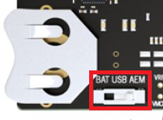

# bt-gatt-data-transfer - Example

The GATT Data Transfer example demonstrates adding custom services and characteristics to your Bluetooth LE Peripheral application.

> Note: this example expects a specific Gecko Bootloader to be present on your device. For details, please take a look at the Troubleshooting section below.

## Designing the GATT Database

The SOC-empty example implements a basic GATT database. GATT definitions (services/characteristics) can be extended using the GATT Configurator, which can be found under Advanced Configurators in the Software Components tab of the Project Configurator. To open the Project Configurator, open the .slcp file of the project.


To learn how to use the GATT Configurator, see [UG438: GATT Configurator User’s Guide for Bluetooth SDK v3.x](https://www.silabs.com/documents/public/user-guides/ug438-gatt-configurator-users-guide-sdk-v3x.pdf).

## Responding to Bluetooth Events

A Bluetooth application is event-driven. The Bluetooth stack generates events, e.g., when a remote device connects or disconnects or when it writes a characteristic in the local GATT database. The application has to handle these events in the `sl_bt_on_event()` function. The prototype of this function is implemented in *app.c*. To handle more events, the switch-case statement of this function is to be extended. For the list of Bluetooth events, see the online [Bluetooth API Reference](https://docs.silabs.com/bluetooth/latest/).

## Implementation on top of SOC-Empty

- Operation/Workflow
    - Start with an existing example (SOC empty)
    - Responding to the events raised by the Bluetooth stack
    - Start with example: soc_empty
    - Add Log component
    - Add USART (for logging messages)
    - Add simple LED
    - Add simple Button

- Simple example
    - GATT Configurator
    - gatt_db.h generated based on GATT configuration
    - **#include** "gatt_db.h"
    - Define ID for chars that we need to interact with in code
    - don’t include “gattdb_” in the name. This is what you use to reference the characteristic
    - LED - control
    - Button - reporting status
    - 
- LED
    - Install Simple LED (Platform → Driver → LED → Simple LED)
    - https://docs.silabs.com/gecko-platform/3.0/driver/api/group-led
    - **#include** "sl_simple_led_instances.h"
    
    ```
    // This event indicates that the value of an attribute in the local GATT
        // database was changed by a remote GATT client.
    
        case sl_bt_evt_gatt_server_attribute_value_id:
          // The value of the gattdb_led_control characteristic was changed.
          if (gattdb_led_state == evt->data.evt_gatt_server_attribute_value.attribute) {
            uint8_t data_recv;
            size_t data_recv_len;
    
            // Read characteristic value.
            sc = sl_bt_gatt_server_read_attribute_value(gattdb_led_state,
                                                        0,
                                                        sizeof(data_recv),
                                                        &data_recv_len,
                                                        &data_recv);
            (void)data_recv_len;
            app_log_status_error(sc);
    
            if (sc != SL_STATUS_OK) {
              break;
            }
    
            // Toggle LED.
            if (data_recv == 0x00) {
              sl_led_turn_off(SL_SIMPLE_LED_INSTANCE(0));
              app_log_info("LED off.\n");
            } else if (data_recv == 0x01) {
              sl_led_turn_on(SL_SIMPLE_LED_INSTANCE(0));
              app_log_info("LED on.\n");
            } else {
              app_log_error("Invalid attribute value: 0x%02x\n", (int)data_recv);
            }
          }
          break;
    ```
    
- Button
    - https://docs.silabs.com/gecko-platform/3.0/driver/api/group-button
    - Install Simple Button
    - **#include** "sl_simple_button_instances.h"
    - Add flag to indicate when to report button state
        
        ```c
        // Flag to indicate when we need to report the button state
        static bool report_button_flag = false;
        ```
        
    - Disable button upon bootup
        
        ```c
        // Make sure there will be no button events before the boot event.
          sl_button_disable(SL_SIMPLE_BUTTON_INSTANCE(0));
        ```
        
    - Enable receiving the event when the button state changes
        
        ```c
        void sl_button_on_change(const sl_button_t *handle)
        {
          if (SL_SIMPLE_BUTTON_INSTANCE(0) == handle) {
            report_button_flag = true;
          }
        }
        ```
        
    - Enable button in sl_bt_on_event:
        
        ```c
        sl_button_enable(SL_SIMPLE_BUTTON_INSTANCE(0));
        
              // Check the report button state, then update the characteristic and
              // send notification.
              sc = update_report_button_characteristic();
              app_log_status_error(sc);
        
              if (sc == SL_STATUS_OK) {
                sc = send_report_button_notification();
                app_log_status_error(sc);
              }
        ```
        
    - Implement sending the notification and also updating the local char value (needed for reads)
        
        ```c
        static sl_status_t update_report_button_characteristic(void);
        static sl_status_t send_report_button_notification(void);
        
        /***************************************************************************//**
         * Updates the Report Button characteristic.
         *
         * Checks the current button state and then writes it into the local GATT table.
         ******************************************************************************/
        static sl_status_t update_report_button_characteristic(void)
        {
          sl_status_t sc;
          uint8_t data_send;
        
          switch (sl_button_get_state(SL_SIMPLE_BUTTON_INSTANCE(0))) {
            case SL_SIMPLE_BUTTON_PRESSED:
              data_send = (uint8_t)SL_SIMPLE_BUTTON_PRESSED;
              app_log_info("button pressed\n");
              break;
        
            case SL_SIMPLE_BUTTON_RELEASED:
              data_send = (uint8_t)SL_SIMPLE_BUTTON_RELEASED;
              app_log_info("button released\n");
              break;
        
            default:
              // Invalid button state
              app_log_info("button state unknown\n");
              return SL_STATUS_FAIL; // Invalid button state
          }
        
          // Write attribute in the local GATT database.
          sc = sl_bt_gatt_server_write_attribute_value(gattdb_button_state,
                                                       0,
                                                       sizeof(data_send),
                                                       &data_send);
          if (sc == SL_STATUS_OK) {
            app_log_info("Attribute written: 0x%02x\n", (int)data_send);
          }
        
          return sc;
        }
        
        /***************************************************************************//**
         * Sends notification of the Report Button characteristic.
         *
         * Reads the current button state from the local GATT database and sends it as a
         * notification.
         ******************************************************************************/
        static sl_status_t send_report_button_notification(void)
        {
          sl_status_t sc;
          uint8_t data_send;
          size_t data_len;
        
          // Read report button characteristic stored in local GATT database.
          sc = sl_bt_gatt_server_read_attribute_value(gattdb_button_state,
                                                      0,
                                                      sizeof(data_send),
                                                      &data_len,
                                                      &data_send);
          if (sc != SL_STATUS_OK) {
            return sc;
          }
        
          // Send characteristic notification.
          sc = sl_bt_gatt_server_notify_all(gattdb_button_state,
                                            sizeof(data_send),
                                            &data_send);
          if (sc == SL_STATUS_OK) {
            app_log_append(" Notification sent: 0x%02x\n", (int)data_send);
          }
        
          return sc;
        }
        ```
        
    - Handle after bt init successful
        
        ```c
        sl_button_enable(SL_SIMPLE_BUTTON_INSTANCE(0));
        
              // Check the report button state, then update the characteristic and
              // send notification.
              sc = update_report_button_characteristic();
              app_log_status_error(sc);
        
              if (sc == SL_STATUS_OK) {
                sc = send_report_button_notification();
                app_log_status_error(sc);
              }
        ```

## Troubleshooting

### Bootloader Issues

Note that Example Projects do not include a bootloader. However, Bluetooth-based Example Projects expect a bootloader to be present on the device in order to support device firmware upgrade (DFU). To get your application to work, you should either 
- flash the proper bootloader or
- remove the DFU functionality from the project.

**If you do not wish to add a bootloader**, then remove the DFU functionality by uninstalling the *Bootloader Application Interface* software component -- and all of its dependants. This will automatically put your application code to the start address of the flash, which means that a bootloader is no longer needed, but also that you will not be able to upgrade your firmware.

**If you want to add a bootloader**, then either 
- Create a bootloader project, build it and flash it to your device. Note that different projects expect different bootloaders:
  - for NCP and RCP projects create a *BGAPI UART DFU* type bootloader
  - for SoC projects on Series 1 devices create a *Bluetooth in-place OTA DFU* type bootloader or any *Internal Storage* type bootloader
  - for SoC projects on Series 2 devices create a *Bluetooth Apploader OTA DFU* type bootloader

- or run a precompiled Demo on your device from the Launcher view before flashing your application. Precompiled demos flash both bootloader and application images to the device. Flashing your own application image after the demo will overwrite the demo application but leave the bootloader in place. 
  - For NCP and RCP projects, flash the *Bluetooth - NCP* demo.
  - For SoC projects, flash the *Bluetooth - SoC Thermometer* demo.

**Important Notes:** 
- when you flash your application image to the device, use the *.hex* or *.s37* output file. Flashing *.bin* files may overwrite (erase) the bootloader.

- On Series 1 devices (EFR32xG1x), both first stage and second stage bootloaders have to be flashed. This can be done at once by flashing the *-combined.s37* file found in the bootloader project after building the project.

- On Series 2 devices SoC example projects require a *Bluetooth Apploader OTA DFU* type bootloader by default. This bootloader needs a lot of flash space and does not fit into the regular bootloader area, hence the application start address must be shifted. This shift is automatically done by the *Apploader Support for Applications* software component, which is installed by default. If you want to use any other bootloader type, you should remove this software component in order to shift the application start address back to the end of the regular bootloader area. Note, that in this case you cannot do OTA DFU with Apploader, but you can still implement application-level OTA DFU by installing the *Application OTA DFU* software component instead of *In-place OTA DFU*.

For more information on bootloaders, see [UG103.6: Bootloader Fundamentals](https://www.silabs.com/documents/public/user-guides/ug103-06-fundamentals-bootloading.pdf) and [UG489: Silicon Labs Gecko Bootloader User's Guide for GSDK 4.0 and Higher](https://cn.silabs.com/documents/public/user-guides/ug489-gecko-bootloader-user-guide-gsdk-4.pdf).


### Programming the Radio Board

Before programming the radio board mounted on the mainboard, make sure the power supply switch is in the AEM position (right side) as shown below.




## Resources

[Bluetooth Documentation](https://docs.silabs.com/bluetooth/latest/)

[UG103.14: Bluetooth LE Fundamentals](https://www.silabs.com/documents/public/user-guides/ug103-14-fundamentals-ble.pdf)

[QSG169: Bluetooth SDK v3.x Quick Start Guide](https://www.silabs.com/documents/public/quick-start-guides/qsg169-bluetooth-sdk-v3x-quick-start-guide.pdf)

[UG434: Silicon Labs Bluetooth ® C Application Developer's Guide for SDK v3.x](https://www.silabs.com/documents/public/user-guides/ug434-bluetooth-c-soc-dev-guide-sdk-v3x.pdf)

[Bluetooth Training](https://www.silabs.com/support/training/bluetooth)

## Report Bugs & Get Support

You are always encouraged and welcome to report any issues you found to us via [Silicon Labs Community](https://www.silabs.com/community).
